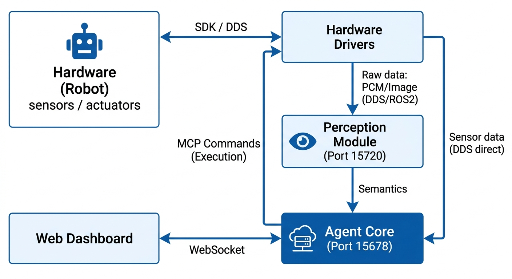

# Phanthy Motus

[中文文档](README_zh.md) | [Official Website](https://motus.phanthy.com)

**Give Embodied AI a Real Soul.** PhanthyMotus is a next-generation, open-source framework and platform for Embodied AI Agents. Built upon a robust ROS2 foundation, it seamlessly bridges diverse sensor inputs with advanced robot execution. By enabling flexible integration of World Models, LLMs, and VLMs, PhanthyMotus transforms traditional hardware into soulful, intelligent assistants capable of perceiving, thinking, and acting independently in the real world.

## Quick Start

Install and run with a single command:

```bash
curl -fsSL https://motus.phanthy.com/install.sh | sudo bash
```

Or specify a version:

```bash
curl -fsSL https://motus.phanthy.com/install.sh | sudo bash -s <tag>
```

The install script will automatically install Docker (if needed), pull the latest Agent Core image, and start the service.

Open `http://<device-ip>:15678` to access the Web Dashboard.

Browse available versions and images at the [Resource Center](https://motus.phanthy.com).

### Connect Hardware

Deploy hardware drivers from **[phanthymotus-driver](https://github.com/4paradigm/phanthymotus-driver)**. Drivers automatically register with Agent Core on startup — no manual configuration needed.

### Build from Source

See [CONTRIBUTING.md](CONTRIBUTING.md) for building and running from source code.

## Features

- **Visual Orchestration** — Drag-and-drop web dashboard for connecting devices, sensors, and AI models on a canvas
- **MCP Data Bus** — Unified [Model Context Protocol](https://modelcontextprotocol.io) interface for all hardware devices
- **Driver-Inferred Topics** — Output ROS2 topics are declared by drivers, not computed by the core. The canvas calls each driver's `info` action (passing `instance_id` for sensors or `input_topic` for processors) to get the exact topic path before the device starts, keeping all topic naming logic inside the driver
- **Event-Driven Agent Loop** — LLM-powered reasoning with multi-turn tool calling, driven by real-time sensor events
- **ROS2 Integration** — Native DDS bridge for seamless ROS2 topic relay and monitoring
- **Pluggable Perception** — Modular ASR/TTS stack with multi-instance support and local inference (Jetson)
- **Web Dashboard** — Real-time device monitoring, agent activity stream, and configuration — all from the browser

## Architecture



Hardware drivers are maintained in a separate repository: **[phanthymotus-driver](https://github.com/4paradigm/phanthymotus-driver)**.

## Web Dashboard

The dashboard at `http://<device-ip>:15678` provides:

### Canvas — Visual Orchestration

Add sensors and actuators you need onto the canvas, connect them to the core Agent Loop, and the framework handles data flow and execution automatically. Build your embodied AI agent like stacking building blocks.


### Real-Time Monitoring

Live sensor data visualization — audio waveforms, battery status, 3D skeleton/point cloud, and more.


### Agent Definition

Define the agent's identity, system prompt, and long-term memory directly from the UI.


### History Logs

Browse past agent sessions with full event traces and tool call results.


### Skill Management

A community-driven Skill Marketplace where users share and discover skills. Browse and install skills contributed by others, or teach your robot new capabilities using natural language — no coding required.


### Service Deployment

Deploy and manage Agent Core and hardware driver containers from the dashboard.


## Ports

| Service | Port |
|---------|------|
| Agent Core | 15678 |
| Perception MCP | 15720 |
| Perception WebSocket | 15721 |

Hardware driver ports are documented in [phanthymotus-driver](https://github.com/4paradigm/phanthymotus-driver).

## Resource Center (Optional)

The platform can optionally connect to a [Resource Center](https://motus.phanthy.com) for:
- Browsing and deploying pre-built driver/perception images
- Managing skills and extensions
- OTA updates

Configure via the `RESOURCE_CENTER_URL` environment variable.

## Contributing

See [CONTRIBUTING.md](CONTRIBUTING.md) for development setup, architecture details, and guidelines.

## License

[Apache License 2.0](LICENSE)

