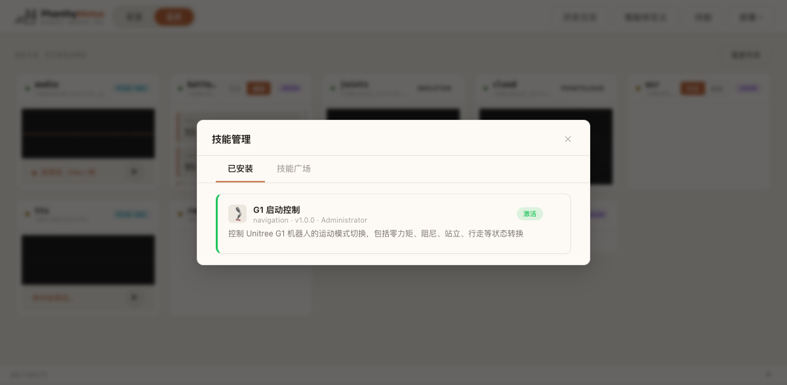
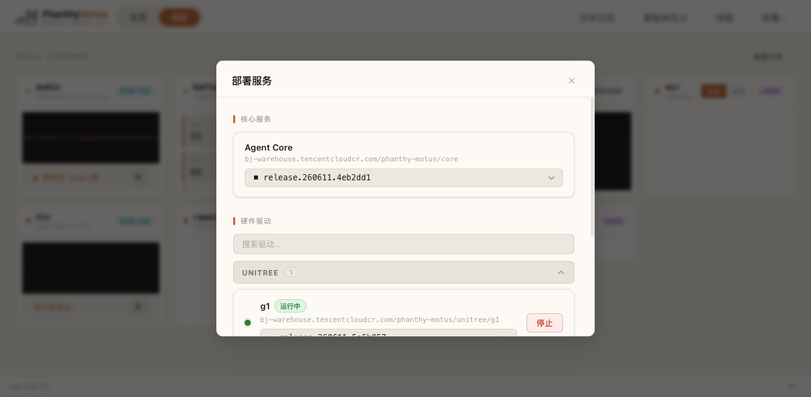

# Phanthy Motus

[中文文档](README_zh.md) | [Official Website](https://motus.phanthy.com)

**Give Embodied AI a Real Soul.** PhanthyMotus is a next-generation, open-source framework and platform for Embodied AI Agents. Built upon a robust ROS2 foundation, it seamlessly bridges diverse sensor inputs with advanced robot execution. By enabling flexible integration of World Models, LLMs, and VLMs, PhanthyMotus transforms traditional hardware into soulful, intelligent assistants capable of perceiving, thinking, and acting independently in the real world.

## Quick Start

Install and run with a single command:

```bash
curl -fsSL https://motus.phanthy.com/install.sh | sudo bash
```

Or specify a version:

```bash
curl -fsSL https://motus.phanthy.com/install.sh | sudo bash -s <tag>
```

The install script will automatically install Docker (if needed), pull the latest Agent Core image, and start the service.

Open `https://<device-host>:15678` to access the Web Dashboard. Agent Core's
compatibility certificate is self-signed, so a browser may show a certificate
warning until a deployment certificate is configured as described below.

Browse available versions and images at the [Resource Center](https://motus.phanthy.com).

### Connect Hardware

Deploy hardware drivers from **[phanthymotus-driver](https://github.com/4paradigm/phanthymotus-driver)**. Drivers automatically register with Agent Core on startup — no manual configuration needed.

### Build from Source

See [CONTRIBUTING.md](CONTRIBUTING.md) for building and running from source code.

## Features

- **Visual Orchestration** — Drag-and-drop web dashboard for connecting devices, sensors, and AI models on a canvas
- **MCP Data Bus** — Unified [Model Context Protocol](https://modelcontextprotocol.io) interface for all hardware devices
- **Driver-Inferred Topics** — Output ROS2 topics are declared by drivers, not computed by the core. The canvas calls each driver's `info` action (passing `instance_id` for sensors or `input_topic` for processors) to get the exact topic path before the device starts, keeping all topic naming logic inside the driver
- **Event-Driven Agent Loop** — LLM-powered reasoning with multi-turn tool calling, driven by real-time sensor events
- **ROS2 Integration** — Native DDS bridge for seamless ROS2 topic relay and monitoring
- **Pluggable Perception** — Modular ASR/TTS stack with multi-instance support and local inference (Jetson)
- **Web Dashboard** — Real-time device monitoring, agent activity stream, and configuration — all from the browser

## Architecture


Hardware drivers are maintained in a separate repository: **[phanthymotus-driver](https://github.com/4paradigm/phanthymotus-driver)**.

### Memory & Long-Running Agent Architecture

The Agent Core is designed for **continuous operation over days or months**. The architecture separates real-time interaction from background intelligence:

```
┌─────────────────────────────────────────────────────┐
│                   Main Agent Loop                     │
│  • Only processes user interactions (ASR/message)    │
│  • Lean history → stable prefix caching (~90% hit)   │
│  • Uses memory_recall for on-demand context retrieval│
└──────────────┬──────────────────────┬───────────────┘
               │ spawn                │ memory_recall
               ▼                      ▼
┌──────────────────────┐   ┌──────────────────────────┐
│   User Task Subagent │   │    Memory Store (SQLite)  │
│  • Isolated context  │   │  • subagent_conclusions   │
│  • Full tool access  │   │  • chat_history (FTS5)    │
│  • Returns summary   │   │  • daily_summary          │
└──────────────────────┘   └──────────────────────────┘
               ▲
┌──────────────────────┐
│    BG Monitor Agent   │
│  • Sensor analysis   │
│  • Results → DB only │
│  • urgent=true → push│
└──────────────────────┘
```

**Key design principles:**

- **Main agent stays lean** — only user interactions enter the conversation history. Background monitoring conclusions are stored in the memory database, not pushed to the main thread.
- **Memory recall on demand** — `memory_recall` tool provides FTS-based retrieval from past conversations, subagent conclusions, and daily summaries. Both main agent and subagents can use it.
- **Urgent interrupts only** — background subagents only interrupt the main agent for safety-critical alerts (battery critical, hardware faults). Routine reports go to the database silently.
- **Daily auto-summary** — a scheduled subagent generates daily reports covering user interactions, task completion, anomalies, performance review, and skill discovery opportunities.
- **Prefix caching optimized** — stable system prompt (L1 + L2-static) is frozen per turn; dynamic status is minimal and placed in user messages to maximize LLM prefix cache hits.

## Web Dashboard

The dashboard at `https://<device-host>:15678` provides:

### Canvas — Visual Orchestration

Add sensors and actuators you need onto the canvas, connect them to the core Agent Loop, and the framework handles data flow and execution automatically. Build your embodied AI agent like stacking building blocks.


### Real-Time Monitoring

Live sensor data visualization — audio waveforms, battery status, 3D skeleton/point cloud, and more.


### Agent Definition

Define the agent's identity, system prompt, and long-term memory directly from the UI.


### History Logs

Browse past agent sessions with full event traces and tool call results.


### Skill Management

A community-driven Skill Marketplace where users share and discover skills. Browse and install skills contributed by others, or teach your robot new capabilities using natural language — no coding required.



### Service Deployment

Deploy and manage Agent Core and hardware driver containers from the dashboard.



## Deployment Architecture

All services run as Docker containers managed by a single `docker-compose.yml` at `/opt/phanthy-motus/` on the target device.

### How it works

1. **Install**: The `install.sh` script pulls the Agent Core image, extracts the initial `docker-compose.yml` from the image, and starts the service
2. **Add drivers**: When you deploy a driver via the Web Dashboard, Agent Core pulls the driver image, extracts its `deploy/service.yml` fragment, and merges it into the compose file
3. **Unified orchestration**: All containers (core, drivers, perception) are managed by the same compose file with `docker compose up -d`

### Container privileges

All driver and perception containers run with `privileged: true` and `/dev:/dev` mounted to access hardware devices (cameras, USB, GPIO). Network is set to `host` mode for ROS2 DDS communication.

```yaml
# Example: how a deployed service looks in /opt/phanthy-motus/docker-compose.yml
services:
  agent-core:
    image: registry/core:tag
    network_mode: host
    ipc: host
    pid: host
    privileged: true
    volumes:
      - /dev:/dev
      - /opt/phanthy-motus/data:/work/resource
    ...
  unitree-g1:
    image: registry/drivers/unitree/g1:tag
    network_mode: host
    ipc: host
    pid: host
    privileged: true
    volumes:
      - /dev:/dev
    ...
```

## Ports

| Service | Port |
|---------|------|
| Agent Core | 15678 |
| Perception MCP | 15720 |
| Perception WebSocket | 15721 |

Hardware driver ports are documented in [phanthymotus-driver](https://github.com/4paradigm/phanthymotus-driver).

## Resource Center (Optional)

The platform can optionally connect to a [Resource Center](https://motus.phanthy.com) for:
- Browsing and deploying pre-built driver/perception images
- Managing skills and extensions
- OTA updates

Configure via the `RESOURCE_CENTER_URL` environment variable.

## System Hooks

System hooks provide **instant, bypass-LLM actions** for time-critical responses. Drivers declare hook bindings via `x-hooks` in their MCP tool schema; Agent Core fires them directly on system events without waiting for LLM or ACP barrier.

### Architecture

```
System Event (ASR arrives / LLM starts / error)
  → Agent Core hooks.fire("on_thinking")
  → call_tool_direct() to driver (bypasses barrier + ACP)
  → Driver executes immediately (LED effect, interrupt, etc.)
```

### Available Hooks

| Hook | Trigger | Example |
|------|---------|---------|
| `on_hearing` | Voice activity detected | LED blink blue |
| `on_kws_wakeup` | Wake word detected | LED solid blue 2s |
| `on_thinking` | LLM inference starts | LED rainbow breathe |
| `on_error` | LLM failure | LED red flash 5s |
| `on_interrupt_all` | User barge-in | Stop TTS + motion |

### API

```bash
POST /api/hooks/fire  {"hook": "on_interrupt_all"}
GET  /api/hooks       # list all registered hooks
```

See [phanthymotus-driver/README_dev.md](../phanthymotus-driver/README_dev.md) for driver implementation guide.

## Contributing

See [CONTRIBUTING.md](CONTRIBUTING.md) for development setup, architecture details, and guidelines.

### Shadow teleop session console

Agent Core serves `https://<robot-host>:15678/teleop.html` as the authenticated Shadow teleop console. Viewers get a de-identified trusted-device/busy directory; operators and owners can acquire one exclusive session, renew its Core lease, enter Pause or HOLD, inspect Driver diagnostics and audit events, negotiate a real two-channel WebRTC peer, and release it. On a secure-context browser that reports `immersive-vr` support, an operator can explicitly enter Quest WebXR after the exact Core session is Active, owned by this tab, and both RTC channels are open. The page then samples the `local-floor` viewer and unique left/right `tracked-pointer` grip poses and sends `motus.teleop.rtc-frame.v1` frames over `teleop-pose`. Normal samples are limited to 60 Hz; a tracking/deadman degradation may preempt the next rate slot so the fail-safe frame is not delayed.

For a repeatable Quest deployment, use one exact hostname to open the console
and install a certificate whose Subject Alternative Name (SAN) covers that
hostname and whose complete chain is accepted by Quest Browser. Place the
files under the host's mounted deployment directory and configure both paths
in `/opt/phanthy-motus/.env`:

```dotenv
MOTUS_TLS_CERT_FILE=/opt/phanthy-motus/tls/fullchain.pem
MOTUS_TLS_KEY_FILE=/opt/phanthy-motus/tls/privkey.pem
```

Both settings are required together and refer to paths inside the Core
container. The private key must be owner-only (`0600` or `0400`). If exactly
one setting is present, either configured path is not a regular file, the key
permissions are broader, or the certificate and key do not form a parseable
matching server pair, Core stops instead of silently replacing deployment
material. Restart Core after certificate rotation. With neither setting, Core keeps the backwards-compatible
`/work/resource/certs/cert.pem` and `key.pem` pair and generates a self-signed
pair only when both files are absent; an older, Core-owned unlinked fallback
key is automatically restricted to `0600`. Core never changes the target mode
of a symlinked or multiply-linked managed key. That fallback provides TLS transport but
does **not** guarantee browser trust, a WebXR secure context, or Quest-device
readiness.

Before a Quest session, open the exact configured hostname in Quest Browser
and verify all of the following: there is no certificate interstitial, the
console reports `window.isSecureContext=true`, `immersive-vr` is supported, and
an explicit user click successfully obtains the required `local-floor` XR
session. Merely seeing an `https://` URL or finding a certificate file on Core
is not acceptance evidence.

WebXR deadman is opt-in: both valid `xr-standard` squeeze buttons must be held, and entry, reconnect, or tracking loss requires an observed release before a deliberate re-grip can re-arm it. Emulated positions are untracked. A 64 KiB message limit, a 16 KiB DataChannel buffered-amount high-water mark, send errors, RTC loss, XR or document visibility loss, `local-floor` reset, page exit, logout, and Pause/HOLD/Release all fail safe by releasing deadman and closing XR plus RTC; none of these paths automatically reconnect, re-enter VR, or Acquire. The XR animation loop also invokes the existing authenticated Core heartbeat near every five seconds when its single-flight guard is idle, because headset timer throttling must not move lease renewal onto RTC pose traffic.

The transmitted values are raw right-handed WebXR `local-floor` coordinates in metres: +X right, +Y up, -Z forward, with quaternion order `[x,y,z,w]`. They are **not mapped to a robot frame**. The Driver remains `recording`/`would_apply` Shadow-only with `hardware output false`; the UI exposes pose freshness/latest sequence and dispatch evidence. This path has not yet been validated on a physical Quest and robot, and it cannot actuate a robot. The current immersive view is intentionally a diagnostic black field: it contains neither robot video nor an in-headset HUD. Tracking, deadman, sequence, and dispatch evidence remain on the 2D mirror page, so use Quest casting or a desktop browser to observe them.

Core's default self-signed TLS fallback does **not** prove that Quest Browser will trust the site or expose WebXR on a physical headset. Use the exact hostname by which Quest accesses Core, a certificate whose hostname/SAN and trust chain are accepted by that browser, and treat the console's displayed origin plus live `isSecureContext` and `immersive-vr` results as the acceptance check. Explicit certificate/key deployment is intentionally outside this slice.

Configure `ACCESS_TOKEN` for the backwards-compatible owner and named identities in `MOTUS_OPERATOR_TOKENS` / `MOTUS_VIEWER_TOKENS`. For a multi-Driver deployment, use strict JSON maps keyed by the exact stable MCP `id`:

```dotenv
MOTUS_DRIVER_TOKENS={"teleop-shadow-lab-a":"unique-driver-token-a-000001","teleop-shadow-lab-b":"unique-driver-token-b-000002"}
MOTUS_TELEOP_TICKET_SECRETS={"teleop-shadow-lab-a":"at-least-32-unique-random-bytes-a","teleop-shadow-lab-b":"at-least-32-unique-random-bytes-b"}
MOTUS_ENFORCE_DRIVER_AUTH=true
```

Core rejects duplicate ids, invalid ids, duplicate values across dedicated Bearer/ticket credential classes, and reuse with human or legacy credentials. A dedicated Bearer must contain 24–4096 restricted ASCII characters (`A-Z`, `a-z`, digits, `.`, `_`, `~`, `+`, `/`, `=`, `-`), can register only its mapped `driver_id`, and is accepted only through `X-Motus-Driver-Token` or `Authorization: Bearer`—registration query parameters never carry credentials. Every capability, MCP, SSE, teleop-session, and WebRTC `/offer` request selects that exact Driver's secret; an empty or invalid identity fails before a trusted network request. A dedicated registration persists only a one-way, id-bound credential binding—not the token. Adding or rotating that Driver's map entry quarantines the old trusted record before startup networking and requires a fresh inbound registration with the selected token; a stale dedicated binding cannot silently downgrade to the legacy fallback. The corresponding per-Driver ticket secret (at least 32 UTF-8 bytes) signs only that Driver's 20-second one-use offers. A robot is not teleop-ready and Acquire fails with `teleop_signaling_unavailable` when no exact or legacy ticket secret is selectable. Neither map, selected secret, ticket, nor fence is persisted in the Driver directory, registry, audit, or browser response.

`MOTUS_DRIVER_TOKEN` and `MOTUS_TELEOP_TICKET_SECRET` remain optional migration fallbacks for ids absent from their maps; a mapped id never falls back. Remove both after every Driver has migrated. Operators are restricted to the dedicated `/api/teleop/*` session surface, viewers cannot mutate sessions, and existing APIs, Canvas calls, and WebSockets remain owner-only. Configuring any Driver or ticket credential automatically enables this API authentication boundary; without an `ACCESS_TOKEN` owner, protected management APIs fail closed with `401`. Core reads these values from `/opt/phanthy-motus/.env` as well as explicit process environment variables.

`MOTUS_ENFORCE_DRIVER_AUTH=false` is the compatibility default: legacy MCP services continue to run but never receive teleop trust. After every service supports authenticated registration and MCP requests, set it to `true` so unauthenticated registrations remain quarantined discovery records. See [`deploy/.env.example`](deploy/.env.example) for the exact format.

In-process desktop code, mutation, and arbitrary URL fetch tools (`Bash`, `PythonExec`, `Write`, `Edit`, and `WebFetch`) are not exposed to the LLM by default and cannot be enabled while human, Driver, or teleop credentials are configured. Read-only local file tools also deny deployment `.env`, private-key, certificate-container, and runtime configuration database paths, including symlink aliases. `MOTUS_ENABLE_UNSAFE_DESKTOP_CODE_TOOLS=true` is an explicit secret-free development escape hatch only; these in-process tools are not a security sandbox and must never be enabled in an authenticated deployment.

Bearer and ticket changes are loaded only when Core starts; each Driver loads its paired values when that Driver starts. Never rotate credentials during an acquired session. Pause and Release the session, verify lifecycle `stop`/watchdog-safe evidence, update both sides, restart the Driver and Core in a coordinated maintenance window, then require fresh registration, ping, Shadow session, health `rtc_enabled=true`, and a real `/offer` smoke before restoring use. Remove a legacy fallback only after every instance passes. Dedicated credential bindings prevent a newly selected dedicated Bearer from being sent before re-registration. For an id still using the unbound legacy fallback, if the old endpoint itself may be compromised, first keep robot execution stopped and remove or owner-isolate that persisted trusted target after resolving any authority guard; otherwise startup can send the new legacy Bearer to the old owner-pinned URL. A shared-secret rollback is not a normal recovery path.

The supported descriptor requires `protocol="motus.teleop.shadow.v1"`, `dispatch_contract="motus.teleop.dispatch.recording.v1"`, `mode="shadow"`, `actuation_enabled=false`, a 64-character lowercase hexadecimal `capability_digest`, actions `prepare_shadow/heartbeat/pause/release/soft_stop/status/stop`, and signaling declared as `motus.teleop.webrtc-offer-answer.v1` at `/offer` with `authenticated-core-proxy-only` access. `stop` is the fence-free lifecycle safety boundary used during restart reconciliation. Tools carrying `x-teleop` are excluded from ordinary Canvas, LLM schemas, and generic MCP calls.

The browser sends only `{type: "offer", sdp}` to the authenticated same-origin Core route. Core binds a 20-second one-use HMAC ticket to the exact session, authority fence, capability digest, and SDP hash, then proxies it with the Driver bearer to the already pinned Driver `/offer` endpoint. Only `{type: "answer", sdp}` returns to the browser; the ticket and fence stay server-side. WebRTC DataChannels then run directly between the browser/Quest and Driver, so the Driver's ICE candidates must be reachable from the headset even though its HTTP endpoint remains loopback-only for Core. Entering immersive VR is always a direct user-click action that requests the required `local-floor` feature; support probing never opens a session.

The console exposes a fixed, secret-free final-dispatch projection (state, generation, admitted/recorded sequence, stop acknowledgement and counters). Before the first `prepare_shadow` call, Core now commits a secret-free authority guard to SQLite. A Core restart restores that record only as a deny-only robot gate: it never restores the old session, fence, browser identity, or control authority. Ordinary actuator commands and new Acquire attempts remain blocked, and the guarded Driver/root target cannot be removed, retargeted, or rebound while recovery is pending.

Only an owner may call `POST /api/teleop/authority-guards/{robot_id}/reconcile`. Core first requires the exact trusted Driver identity, capability digest, and target fingerprint recorded before the crash. It then clears the guard only when the same Driver boot proves a newer `safe_revoked` generation, a new boot proves `safe_unarmed` with its startup stop acknowledgement, or a fence-free lifecycle `stop` returns a strictly validated safe response. The persistent row is deleted before the in-process command gate is reopened; an unreadable store, changed target, malformed proof, uncertain delete, or pending stop keeps the robot quarantined and retryable.

This recovery design supports one Core process using its configured SQLite database; active/active Core replicas or independent database copies do not share an authority gate and are not supported. When upgrading from a version without persistent guards, safely stop and release every existing teleop/robot session before replacing and restarting Core—the new table cannot represent authority that belonged to the old process. Do not roll back to a pre-guard Core while any guard or recovery is pending: first complete owner reconciliation and verify the Driver is safe, or keep Core and robot execution stopped. Older Core versions silently ignore this table. This remains a Shadow-only path with `hardware output false`; persistent recovery does not enable physical actuation.

Authority uses two independent leases. The browser renews a 15-second Core ownership lease every five seconds; Core alone sends the trusted Driver heartbeat at up to 250 ms intervals, inside the Driver's default one-second watchdog. Pose traffic never renews either ownership boundary. A closed/throttled page, Core shutdown, Driver restart, identity mismatch, or heartbeat failure therefore terminates authority without an automatic reacquire. Internal deadlines use a monotonic clock, Driver epochs persist in SQLite, and the fence credential is never returned to the browser, audit database, Activity stream, or generic MCP paths.

## License

[Apache License 2.0](LICENSE)
