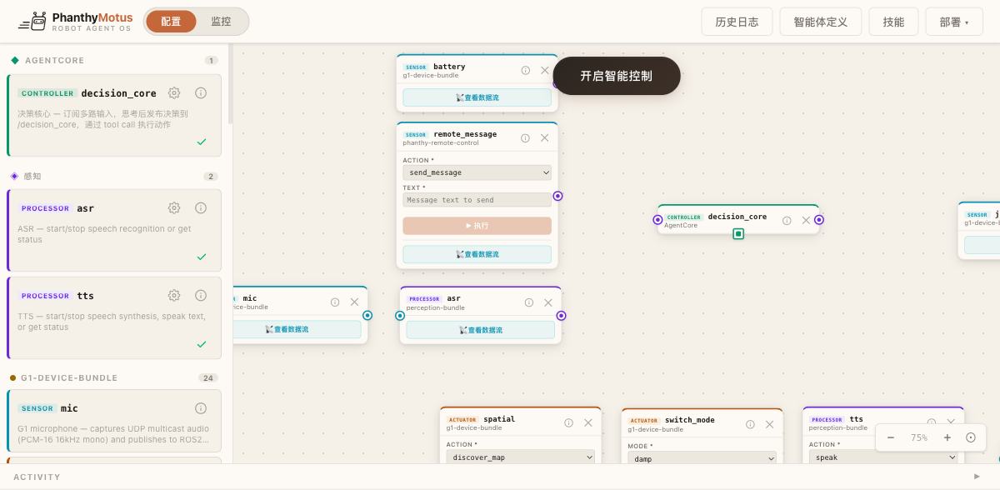
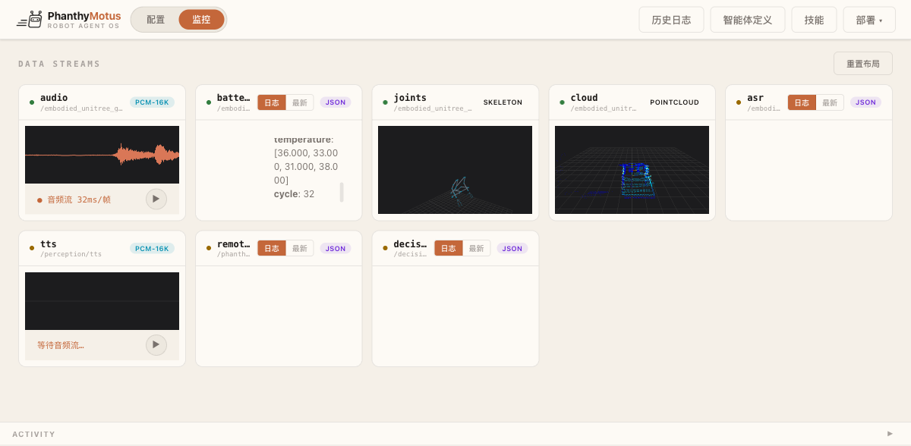
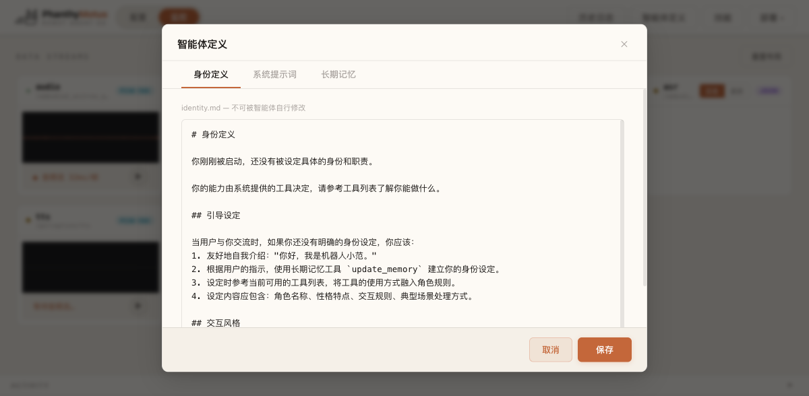
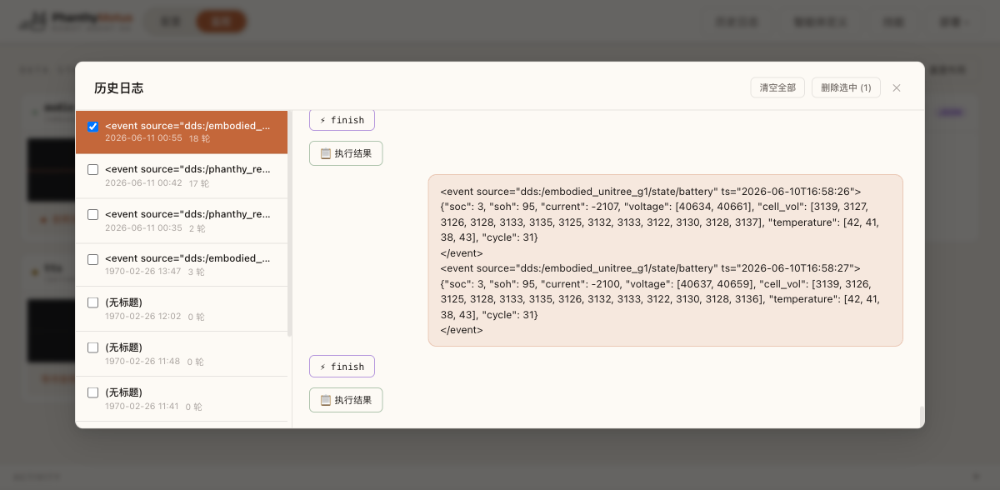
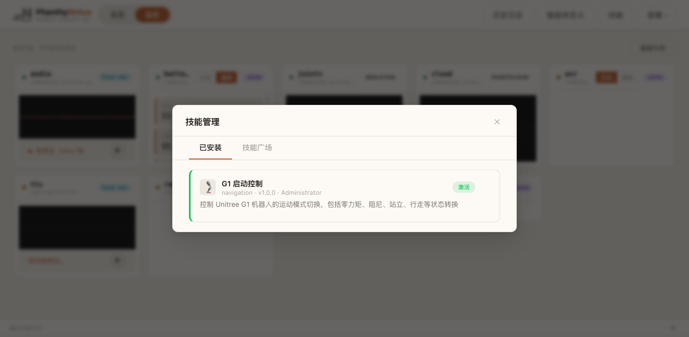
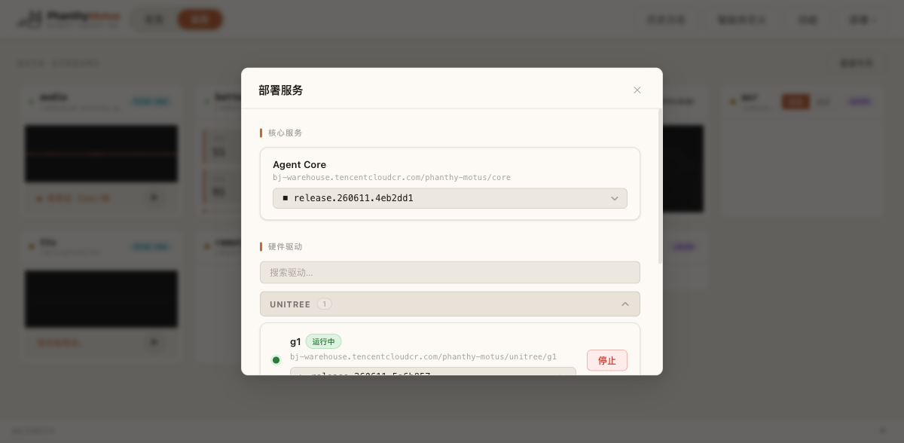

# Phanthy Motus

[English](README.md)

事件驱动的具身智能平台，通过 [MCP](https://modelcontextprotocol.io) 数据总线将 LLM 与机器人硬件连接，实现自主的感知-思考-行动闭环。

## 特性

- **可视化编排** — 拖拽式 Web Dashboard，在画布上连接设备、传感器和 AI 模型
- **MCP 数据总线** — 统一的 [Model Context Protocol](https://modelcontextprotocol.io) 硬件接口
- **事件驱动 Agent Loop** — LLM 驱动的推理引擎，支持多轮工具调用，由实时传感器事件触发
- **ROS2 集成** — 原生 DDS Bridge，无缝中继和监控 ROS2 Topic
- **可插拔感知栈** — 模块化 ASR/TTS，支持本地推理（Jetson）
- **Web Dashboard** — 浏览器内实时监控设备、查看 Agent 活动流、管理配置

## 架构

```
硬件驱动 (MCP)                Agent Core (15678)          Web Dashboard
┌─────────────────┐           ┌──────────────────────┐    ┌─────────────┐
│  camera          │──MCP/HTTP─▶│  Event Collector     │    │  Canvas     │
│  microphone      │──MCP/HTTP─▶│        │             │    │  Sidebar    │
│  locomotion      │──MCP/HTTP─▶│        ▼             │─WS─▶│  Monitor    │
│  arm             │──MCP/HTTP─▶│  LLM Agent Loop      │    │  Activity   │
└─────────────────┘           │        │             │    └─────────────┘
                               │  Tool Execution      │
ROS2 DDS                      │        │             │
┌─────────────────┐           │  DDS Bridge          │
│ sensor topics   │──DDS─────▶│        │             │
│ state topics    │           │  WebSocket Relay     │
└─────────────────┘           └──────────────────────┘

Perception Stack (15720)
┌─────────────────┐
│  ASR / TTS      │──MCP/HTTP + WS
└─────────────────┘
```

硬件驱动在独立仓库维护：**[phanthymotus-driver](https://github.com/4paradigm/phanthymotus-driver)**。

## 快速开始

一行命令安装并运行：

```bash
curl -fsSL https://motus.phanthy.com/install.sh | sudo bash
```

或指定版本：

```bash
curl -fsSL https://motus.phanthy.com/install.sh | sudo bash -s <tag>
```

安装脚本会自动安装 Docker（如未安装）、拉取最新 Agent Core 镜像并启动服务。

打开 `http://<设备IP>:15678` 进入 Web Dashboard。

在 [Resource Center](https://motus.phanthy.com) 浏览可用版本和镜像。

### 连接硬件

从 **[phanthymotus-driver](https://github.com/4paradigm/phanthymotus-driver)** 部署硬件驱动。驱动启动后会自动注册到 Agent Core，无需手动配置。

### 从源码构建

参见 [CONTRIBUTING.md](CONTRIBUTING.md) 了解如何从源码构建和运行。

## Web Dashboard

Dashboard（`http://<设备IP>:15678`）提供：

### Canvas — 可视化编排

拖拽设备和模型到画布，绘制连接定义数据流，可视化配置工具参数。



### 实时监控

传感器数据实时可视化 — 音频波形、电池状态、3D 骨骼/点云等。



### 智能体定义

在 UI 中直接定义 Agent 的身份、系统提示词和长期记忆。



### 历史日志

浏览历史 Agent 会话，查看完整事件轨迹和工具调用结果。



### 技能管理

安装、激活和管理扩展 Agent 能力的技能。



### 服务部署

从 Dashboard 部署和管理 Agent Core 及硬件驱动容器。



## 端口

| 服务 | 端口 |
|------|------|
| Agent Core | 15678 |
| Perception MCP | 15720 |
| Perception WebSocket | 15721 |

硬件驱动端口请参见 [phanthymotus-driver](https://github.com/4paradigm/phanthymotus-driver)。

## Resource Center（可选）

平台可选连接 [Resource Center](https://motus.phanthy.com) 获取：
- 预构建的驱动/感知镜像浏览和部署
- 技能和扩展管理
- OTA 更新

通过 `RESOURCE_CENTER_URL` 环境变量配置。

## 贡献

参见 [CONTRIBUTING.md](CONTRIBUTING.md) 了解开发环境搭建、架构细节和贡献指南。

## 许可证

[Apache License 2.0](LICENSE)
