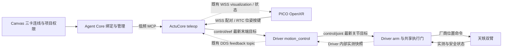

# 遥操架构与当前改造边界

本轮按 [末端遥操实施计划](../plans/teleop-end-effector-architecture.md) 将天轶双臂的新链路拆为 **ActuCore `teleop` → Driver `motion_control` → Driver `arm`**。范围包括 Canvas 三卡绑定、PICO 安装配对、末端输入、Driver 解算与正常结束收臂。日常步骤见 [遥操卡片手册](../../actucore/plugins/teleop/README.md)。

本轮是源码、APK 与离线验证交付，尚未部署机器人，也未完成新版浏览器安装、实体遥操和收臂验收。此前天轶实体 PICO 跟随、松握保持与结束收臂记录属于旧链路，不能代替本轮验证。仅迁移天轶双臂；不增加手腿控制，不迁移或删除既有 G1、VLA 和旧协议能力。

## 三张卡与两条反馈路径

- `teleop` 管理 OpenXR/WSS/RTC、头显身份、输入有效性、双握把、相对映射和通用末端目标，不加载新链路的天轶控制模型，也不输出关节解。
- `motion_control` 位于天轶 Driver 进程，管理 URDF、TCP、标定、FK/IK、碰撞、执行器映射、控制会话与收臂。模型和运动学不能由 PICO 协议推断。
- `arm` 提供关节流入口，复用现有厂商位置发布和共享执行门。该门同时约束原动作与新流输入，保留最终限位限速、反馈检查及停止权；不增加一套独立资源仲裁器。

`ActuCoreBundle` 仍同时提供 VLA 与 teleop，共用 MCP **15730**、ROS executor 和进程。PICO WSS **15741** 是插件内部监听；Driver 中两张卡也不增加独立运控服务。Core 只做卡片、能力协商和低频管理，连续帧不经 Core 转发。

`arm → motion_control` 使用 Driver 内部实测快照及执行记录，不新增中转 topic 或 Canvas 控制边。`motion_control → teleop` 复用 `/{namespace}/motion/teleop/feedback`，包含实测、执行状态、末端快照和可视化。Canvas 随正向连线自动显示 `role: feedback` 虚线；反馈边不作为启动依赖，不形成控制 DAG 环，也不独立驱动动作。

## 绑定与接口

新建天轶配置使用 `control_backend: motion_control`。Canvas 模板生成 `teleop(control/eef) → motion_control → arm(control/joint)`；Core 核对当前注册工具、两段端口、同一 Driver 命名空间和执行资源，并按输出端口协商 descriptor。`motion_control` 的 joint 输出按端口取得对应 control descriptor，不能把第一个 descriptor 套给所有控制端口；JSON feedback 使用独立固定格式，不参与控制 descriptor 协商。单端口旧卡片仍兼容。

Core 向 `project_start` 传入包含 `execution_binding` 的 Driver 绑定，不信任旧画布缓存的地址或 topic。缺边、多目标、错误端口、重复执行来源、不同 Driver 的 arm 或不匹配资源会拒绝开启。旧保存项目保留 legacy 路径，不静默重连到新链路。

| 链路 | topic / 入口 | 内容 |
|---|---|---|
| teleop → motion_control | `/{namespace}/motion/control/command` | `motus.control/2`，`mode=eef_pose` |
| motion_control → arm | `/{namespace}/motion/arm/command` | `motus.control/2`，`mode=joint_position` |
| Driver → teleop | `/{namespace}/motion/teleop/feedback` | 实测、控制权、执行状态、FK 快照、求解决策与 visualization |
| teleop → PICO | 既有 `/ws/teleop-capture` | 配对、信令、操作回执及异步模型显示 |

连续链路使用同机 ROS domain **42** 和最新目标语义；低频获取/释放、标定、配置及收臂继续走 MCP。新协议保留 `motus.control/1`，也保留旧 `control/teleop` 路径。

`motus.control/2` 命令精确包含 `schema`、`boot_id`、`session_id`、`seq`、`source_seq`、`mapping_epoch`、`generated_ns`、`valid_until_ns`、`mode`、`dof`、`values`、`model_version`、`calibration_version`、`frame`、`mac`。`groups`、关节名、单位、资源及速率属于 descriptor，不额外塞入命令。HMAC 使用租约秘密，topic 不传秘密。

`eef_pose` 是左右各一组 `xyz` 米与 `xyzw` 单位四元数，总计 14 个数；`joint_position` 是 descriptor 指定顺序的双臂 14 个 rad 关节值。这两个 14 维并非同一语义。坐标系与模型/标定版本必须匹配 Driver 声明，不把头显采集时间当机器人时钟。

上游末端目标期限最多 **300 ms**，下游关节目标最多 **100 ms**，均使用同机单调时钟。下游期限还受原始输入绝对期限约束；IK 耗时不能通过重新计时续期。Driver 拒绝旧启动/会话、重复乱序序号、旧映射代次、过期、非有限值、无效四元数和不匹配模型。执行循环 50 Hz，速度由 Driver 的 `joint_velocity_rad_s` 控制，表单默认 1 rad/s，并受实际 URDF 上限及 1.5 rad/s 上界共同约束。

## 运动生命周期与收臂

配对、项目 `armed`、会话准备、Driver 控制权、命令发布和实测运动分别报告。Canvas 开启智能控制只授予当前进程内的项目权限，不恢复旧会话或自动运动；下游卡片准备完成后，PICO 才能开始。双握把及新鲜跟踪满足后建立执行租约。每次重握从同一份新鲜 Driver FK 快照建立手柄/实测末端基准，并增加 `mapping_epoch`；头显朝向用于初始化映射，不持续驱动头部。

Shadow 使用同样 Driver 求解器，但仅建立预览身份，不获取执行租约，不发关节/厂商命令；Live 建立独立执行会话。失败 IK、旧映射代次、旧会话或过期解不输出；队列只保留最新待处理目标。同代次在途解仍可在期限内提交，不保证被更新序号替换后立即丢弃。短暂碰撞、不可达或求解超时进入可恢复保持；停止确认且新输入有效后可同会话续接，不重放失败目标。松握后的重握重新建基准；真正故障和停止未确认不自动当作可恢复状态。

正常 `finish` 由 **Driver motion_control** 执行：拒收旧输入，按实测反馈与现有碰撞/速度约束逐步返回厂商模型双臂零位（本轮的自然下垂目标，14 关节 q=0），确认到位和停止后释放。ActuCore 只请求 `finish` 并查询 `finish_status`，不在新链路重复插值或加载模型。接管时姿态不是收臂目标；Shadow 或未开始会话不发送真实回零动作。

PICO/卡片结束要求当前有效头显连接。Core `project_stop` 可以在头显离线时完成同一 Driver 收臂流程：先禁止新开始，再等待最终完成，最后停止下游。重复/并发结束复用操作结果，不重复收臂。立即停止取消收臂，只请求停止释放。失败保留原因和反馈通路，项目保持 `stop_failed`，不凭受理回执报告已停止；原因解除后显式重试。重启、部署或断开头显不隐式收臂。

Driver 生成新鲜实测线、IK 线、目标、躯干/活动边界和最后有效 `HELD` 参考；teleop 经既有 WSS 异步显示，不阻塞控制，也不把历史线当成当前有效解或到位证明。

## 安装配对与配置归属

Canvas 提供安装二维码、15 分钟下载短地址、APK 版本，以及独立的 15 分钟一次性机器人邀请。PICO 浏览器下载安装后，返回安装页点击“打开应用并连接此机器人”，深链接预填机器人身份、endpoint、证书指纹和授权邀请。安装器直接点“打开”没有原链接上下文，只进入发现页；不能猜选附近机器人。手机扫描不会自动安装到头显，PICO 系统扫码/浏览器安装链仍需设备验证。

邀请经认证 Canvas 签发，单次兑换、可撤销，绑定机器人证书。客户端发送邀请前校验证书；已配对冷启动使用保存身份自动连接，身份变化或撤销不会自动建立新信任。连接不授予运动权限。保留原 mDNS/手动地址和双端指纹确认作备用。

签名 release APK 作为固定制品进入普通 ActuCore 镜像，无特殊 build flag 或新增 bot 服务。构建清单记录确定性 gzip 外层大小/SHA256，以及解压后原始 APK 大小/SHA256、版本和签名指纹；Docker 验证两层后仅保存原 APK。Core 从当前注册 ActuCore 的固定下载接口代理，并验证证书、文件大小与 SHA256；用户下载的是原 `.apk`，不需要解压。旧 debug 签名不能被新 release 签名覆盖，须由用户安排明确迁移和重新配对，代码不静默卸载。

配置分属两张卡：teleop 提供模式、输入映射、位移比例和手柄变换；motion_control 提供已挂载 `calibration_path` 导入与 `joint_velocity_rad_s`。Driver 对候选模型/TCP/碰撞/速度完整验证后原子替换，并要求重新标定；已有 Live、Preview、准备会话、动作或收臂时拒绝修改。Core 对 motion_control 先调用 `config`、再用 `info.config` 读回核对，最后持久化确认值；拒绝或未确认时保留原保存值并报告原因，不声称运行配置已回滚。未知字段下发前拒绝，实例配置入口不能绕过共享配置确认。卡片不是标定文件编辑器，也不改写 Driver 的 YAML/JSON 文件。

Core 的 Canvas、LLM 与 direct/hook 管理调用共用 `teleop_management.py`：只有配置中精确匹配的本机 HTTP `/mcp` 地址可收到管理凭据，遥操请求不跟随重定向；密钥不写入卡片参数、topic 或日志。开始会话不隐式重放配置，普通工具保持既有调用语义。

新路径缺少 Driver 控制模型时仍能安装、配对和配置，执行门禁继续拒绝运动；TLS、管理鉴权、状态目录等 ActuCore 自身站点资料缺失仍会返回 `required_site_config`。VLA 及其他插件不因单卡错误被关闭。

## 兼容范围与证据

- 既有天轶 `control_backend=legacy` 保留 ActuCore 本地 IK 和 `teleop_executor` 路径，不自动修改旧项目。新路径只接受双臂，手开合不在本轮范围。
- G1 保留现有模型、映射、IK 与独立 Shadow 路径；`driver_joints` 仅用于 G1 Shadow，只读、不取执行权。G1 不声明天轶项目启停/收臂和录制操作，不迁移到新 motion_control。
- G1 数值环境仍要求 CasADi 与 `pinocchio.casadi`；普通天轶/VLA bundle 中的 Pinocchio 不代表该符号绑定可用。G1 模型、碰撞、依赖、部署和实体结果单独验证，不另开第二套生产 ActuCore 掩盖冲突。
- VLA 和 `motus.control/1` 保留原能力协商；共用进程不意味着所有机器人能力和验收自动统一。

验证分别记录 **代码/离线链路、APK、目标架构镜像、部署与真机验收**。真实 IK + 有限速度 plant 跨仓单元测试替换 MCP/DDS 传输和厂商设备；另有本机 ARM64 禁网隔离集成使用真实 ROS domain 42、Driver bus 子进程及两段命令和反馈 topic，仍替换 MCP HTTP 和厂商本体。前者不代表真实 ROS，后者不代表物理验收。安装页面的本地浏览器测试不等于 PICO 系统安装实测。

回放/现场证据继续关联四段：输入与求解记录、Driver 接收/决策、本体 `cmd_pos`、实测 `arm/status`。分别检查 topic/type/QoS/频率、源序号、映射代次、时效、跟随误差、延迟和恢复耗时；不新增误差百分比通过门槛。源代码通过、容器存活或“运行中”均不能替代物理跟随与停止证据。

源码入口：新输入适配器 [motion_control.py](../../actucore/plugins/teleop/motion_control.py)、[plugin.py](../../actucore/plugins/teleop/plugin.py)，绑定 [teleop_project.py](../../agent-core/src/teleop_project.py)，安装代理 [teleop_install.py](../../agent-core/src/api/teleop_install.py)，跨仓测试 [test_motion_control_chain.py](../../actucore/tests/test_motion_control_chain.py)。Driver 实现在独立仓 `x-humanoid/tianyi2.0/motion_control.py`、`tianyi_motion/` 与 `device.py`；模型、客户端及依赖来源/许可见 [NOTICE.md](../../actucore/plugins/teleop/NOTICE.md) 和 [原生客户端说明](../../actucore/openxr_capture_native/THIRD_PARTY_NOTICES.md)。
