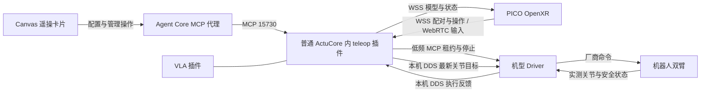

# 遥操架构与当前改造边界

本文基于当前源码整理，解释已经落地的结构与仍存在的缺口。日常使用步骤见 [遥操卡片手册](../../actucore/plugins/teleop/README.md)。天轶已经取得实体输入与收臂证据，但这些证据不代表 G1 的操作生命周期、整个产品部署流程和长时间运行均已完成。

## 已经落地的结构

`ActuCoreBundle` 显式加载 VLA 与 teleop，二者共用进程、MCP 和 ROS executor。teleop 内部创建采集事件循环、调度线程和 ROS 节点；PICO WSS 15741 是插件内部服务，不另注册一套 ActuCore。服务发现、管理代理和 Canvas 配置存储仍由 Agent Core 承担，IK 不在 Core 执行。

源码入口：

| 职责 | 实现 |
|---|---|
| 卡片注册、共享 MCP、遥操管理鉴权 | [actucore/main.py](../../actucore/main.py) |
| 插件配置、标定、连接和操作编排 | [plugin.py](../../actucore/plugins/teleop/plugin.py) |
| 会话／跟踪状态与动作调度 | [runtime.py](../../actucore/plugins/teleop/runtime.py)、[dispatch.py](../../actucore/plugins/teleop/dispatch.py) |
| 配对、连接身份、WebRTC | [capture.py](../../actucore/plugins/teleop/capture.py)、[capture_server.py](../../actucore/plugins/teleop/capture_server.py)、[rtc.py](../../actucore/plugins/teleop/rtc.py) |
| 机型映射与求解 | [tianyi.py](../../actucore/plugins/teleop/tianyi.py)、[kinematics.py](../../actucore/plugins/teleop/kinematics.py)、[g1.py](../../actucore/plugins/teleop/g1.py) |
| Driver 低频管理与连续目标传输 | [adapter.py](../../actucore/plugins/teleop/adapter.py) |
| 头显操作回执与天轶收臂 | [operator_session.py](../../actucore/plugins/teleop/operator_session.py) |
| Canvas 面板与管理代理 | [teleop-panel.js](../../agent-core/web/js/teleop-panel.js)、[mcp_manage.py](../../agent-core/src/api/mcp_manage.py) |

## 运动与状态契约

连接、会话准备、Driver 控制权和真实输出是不同状态。配对只建立头显身份；开始准备会话；双握把与新鲜跟踪输入满足后，适配器才申请或恢复 Driver 租约。每次重新握持用实测双臂建立参考，避免沿用旧手柄原点。连续目标走本机 DDS，不逐帧调用 MCP。

天轶原厂双臂为 14 个关节；G1_23 为 10 个。Driver 校验会话、序号、单调时钟期限、反馈与运动边界，保持最终拒绝执行权。ActuCore 的 IK 解、发布成功、Driver 接受和实测到位不能互相替代。

短暂不可达或 IK 超时丢弃失败结果。天轶配套 Driver 支持可恢复保持时，新的有效解可以同会话续接；普通握把松开、失去跟踪、真正故障和明确结束仍有各自的状态转换。界面把历史有效模型标为 HELD，不能把它冒充当前 IK 结果。

`finish` 与 `stop` 分开：天轶 finish 冻结输入并撤销 assignment，再逐步回双臂零位，确认到位和停止后释放；stop 只请求停止释放，不主动归零。当前收臂使用已有碰撞检查验证每一步，不是绕障规划器。网络断开和部署不会隐式收臂。

## 当前可用与已验证

- 一套 ActuCore 同时提供 VLA 和 teleop；源码及最新统一服务部署记录均已移除生产双 ActuCore 结构。
- Canvas 提供中文配对、配置、标定、会话操作与执行状态；卡片可单独使用，不依赖整个项目运行。
- 天轶 PICO 可就地开始、结束收臂、立即停止；实体跟随与两次收臂已有记录，短暂超时后恢复成功。
- 配置应用先由插件确认，再保存到 Core；ActuCore 自身保留参数缓存，覆盖 Core 未观察到短暂重启的情形。缓存不保存运动权限。
- G1 保留模型、映射和 IK，普通 Driver 可通过只读关节适配器支持 Shadow 显示。北京 G1 仍需独立部署和验证记录。

上述现场事实依据本轮已有的本地部署与验收记录；原始现场日志不在本文发布范围。本次架构整理未连接或调试天轶。手部、长期运行及完整崩溃验收不因双臂操作成功自动标记完成。

## 已知缺口与优先级

### P1：Canvas 与 PICO 还没有共用完整的操作入口

Canvas `start/resume/stop` 直接进入插件 dispatch；PICO 先进入 OperatorCommands，再执行机型操作。PICO 的天轶 start 会自动标定，并对已锁存故障走恢复；Canvas start 要求已经标定，Canvas 还有独立的 resume 按钮。

两条路径还各自维护状态：`runtime.status`、`adapter.output` 和 `operator_commands.status` 分别表达会话、输出及操作回执。面板优先展示 operator 错误，因此混用入口可能保留过时操作错误，虽然其他路径已经改变会话状态。离线直接调用真实 `viewState`，输入 runtime=ready、历史 finish=error，仍得到“故障 / return_timeout”；这证明显示优先级，不等于已复现完整现场触发过程。当前浏览器测试使用 fixture，不足以证明跨入口状态始终一致。

后续应把 Canvas 与头显的 start/finish/stop 路由到同一组操作命令与回执，定义操作 ID、完成状态及取消规则；runtime 继续负责实时输入和会话权限。先补跨入口的契约测试，再改内部状态组织，不重写已跑通的 IK／执行链。

### P1：通用部署还未摆脱现场迁移产物

标准 Dockerfile 已包含 teleop 可选依赖与 DDS 参考文件，但标准 `actucore/deploy/service.yml` 只描述普通服务挂载，没有完整的遥操配置、TLS、配对状态及管理密钥挂载。天轶统一候选中补齐了该站点的部署片段；从源码重新构建公共镜像，并不会自动得到同样完整的站点配置。

本地保留的天轶统一切换和回滚脚本是一次性迁移工具，绑定旧镜像、固定 MCP ID、站点目录，并导入机外试验脚本；这些现场脚本不属于公共发布入口。它们不是北京 G1 或其他机器的通用安装器；旧恢复工具还可能重建已经淘汰的独立遥操服务。

后续应在框架既有部署机制内生成并保留 teleop 的站点配置与挂载，校验能力和实际运行状态；一次性迁移脚本明确归档，不作为日常启动流程。升级保留其他插件、配对身份和用户 Core，不依赖整台机器等于历史 Compose 快照。

### P1：G1 数值依赖尚未纳入通用 bundle 构建

G1 IK 必须同时加载 CasADi 和 `pinocchio.casadi`。历史 G1 ARM64 环境与当前天轶／VLA bundle 使用不同的 Pinocchio、NumPy 版本；当前 bundle 锁未包含 CasADi，CPU Dockerfile 也未使用 G1 数值环境锁。因此工具发现、配对在线和 Shadow 模式本身不能证明 G1 的 IK 已经可用。

北京 G1 展示应先验证目标环境中的符号绑定、实际模型初始化和零输出求解，再验证真实关节反馈。后续在单 ActuCore 构建中定义机型可用的数值环境，核验 VLA 兼容性；不能把两套 ABI 锁叠装或另启第二套 ActuCore 当成已完成架构适配。

### P2：机型能力声明已修正，标定能力仍需收敛

本次已经让 `get_tools()` 按机型提供操作列表：G1 不声明 finish 与录制动作，服务端也明确拒绝这些调用，Canvas 因此不会显示 G1 收臂按钮。没有以隐藏按钮代替收臂实现；头显 OperatorCommands 仍只接到天轶，G1 的头显快捷入口尚未实现。

收臂实现仍要求双臂模式并固定 14 个关节。天轶关闭手部时，静态 capability／资源声明仍存在与实际启用能力不一致的地方。后续应从机型和已加载标定生成输出资源及显示能力，保持 Canvas、PICO 与 Driver 的声明一致。

### P2：配置仍有两个存储与两类更新入口

Core 保存卡片参数，ActuCore 保存已接受配置的缓存；快捷模式切换直接调用 config，不经过完整表单保存到 Core。当前以部署配置哈希约束本地缓存，但没有统一的配置版本和冲突回执。Core 的重连恢复调用也没有读取插件 isError 就记录为 restored。

本次已把 G1 只读反馈源的机型／模式组合，以及 Driver 地址和命名空间校验前移到写盘之前，避免这些无效值先保存、再在 info 初始化时报错。该离线修复不改变已部署天轶，也不等于已经验证所有模型文件和运行时依赖。

后续采用明确的配置版本与 apply/readback 结果，规定缓存和 Core 保存值的优先级；快捷模式切换复用同一保存通路。重连失败要展示具体原因，而不是仅记录请求已发送。

### P2：双臂资源接口仍是两套协议

VLA 使用 `motus.control/1` 及下游 descriptor 协商；teleop 使用专用 `teleop_executor` 租约和版本化目标协议。当前各自有工作实现，但不能从“共用 ActuCore”推断两类指令已经共享全部能力协商、资源命名和诊断语义。

后续先明确 Driver 资源仲裁、时间戳、执行回执与错误码的公共契约，再评估可复用部分；不能直接把已验证遥操换成尚未验证的通用输出通道。

### P2：录制与链路诊断还属于工程入口

天轶录制、独立关节目标回放、实时 IK 回放和四段日志已经存在，但 Canvas 没有录制／报告入口；现场脚本、源码验证、镜像验证和真实反馈记录分散。用户难以通过卡片理解某次保持发生在输入、求解、传输还是 Driver。

后续把最后一次失败阶段、是否自动恢复、最后有效目标年龄和报告入口汇总到卡片诊断，保留原始证据。录制和纯离线分析可以产品化；真实回放作为单独操作，不随打开报告或启动服务自动执行。

## 下一步实施顺序

1. 保持天轶当前接待服务不动；用离线测试和北京 G1 的 Shadow 卡片展示验证用户流程。
2. 提交当前实现、配置拒绝路径及机型操作声明修复申请 review；明确跨入口生命周期、标定能力声明及通用部署的后续范围。
3. 在既有框架里补齐可复现的单 ActuCore 部署和升级，保持 Core 用户改动；独立演练冷启动、配置持久化、配对重连和失败回滚。
4. 统一 Canvas/PICO 操作语义，再针对 G1 实现机型收臂策略和实体测试。天轶现场效果不能作为 G1 的验收替代。
