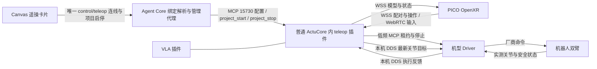

# 遥操架构与当前改造边界

本文基于当前源码及 [Canvas／PICO 生命周期计划](../plans/teleop-canvas-operator-lifecycle.md)，说明架构、操作契约和剩余缺口。日常使用见 [遥操卡片手册](../../actucore/plugins/teleop/README.md)。天轶此前实体输入、跟随和收臂的证据仅对应旧链路；本轮连线绑定、智能控制启停和统一收臂仅离线实现与验证，尚未部署或现场验收，也不代表 G1 已具备相同生命周期。

## 已经落地的结构

`ActuCoreBundle` 显式加载 VLA 与 teleop，二者共用进程、MCP 和 ROS executor。teleop 内部创建采集事件循环、调度线程和 ROS 节点；PICO WSS 15741 是插件内部服务，不另注册一套 ActuCore。服务发现、管理代理和 Canvas 配置存储仍由 Agent Core 承担，IK 不在 Core 执行。

天轶 Driver 的 `teleop_executor` 声明 `control/teleop` 输入和 `x-teleop-target`，其中包含协议版本、机型、命名空间以及真实命令／反馈 topic。Core 用已保存的唯一控制连线查找当前注册工具，再结合注册的本机 MCP 地址生成 `driver_binding`；ActuCore 接受该绑定后选择执行通路。画布缓存的 topic 和旧手填 endpoint 不作为绑定依据，缺失、多目标或不兼容声明会拒绝开启。此处连线负责选择目标，连续目标仍由 ActuCore 直接发送，不经 Core 逐帧转发，也没有增加新的 Driver 运动协议。

源码入口：

| 职责 | 实现 |
|---|---|
| 卡片注册、共享 MCP、遥操管理鉴权 | [actucore/main.py](../../actucore/main.py) |
| 插件配置、标定、连接和操作编排 | [plugin.py](../../actucore/plugins/teleop/plugin.py) |
| 会话／跟踪状态与动作调度 | [runtime.py](../../actucore/plugins/teleop/runtime.py)、[dispatch.py](../../actucore/plugins/teleop/dispatch.py) |
| 配对、连接身份、WebRTC | [capture.py](../../actucore/plugins/teleop/capture.py)、[capture_server.py](../../actucore/plugins/teleop/capture_server.py)、[rtc.py](../../actucore/plugins/teleop/rtc.py) |
| 机型映射与求解 | [tianyi.py](../../actucore/plugins/teleop/tianyi.py)、[kinematics.py](../../actucore/plugins/teleop/kinematics.py)、[g1.py](../../actucore/plugins/teleop/g1.py) |
| Driver 低频管理与连续目标传输 | [adapter.py](../../actucore/plugins/teleop/adapter.py) |
| 头显操作回执与天轶收臂 | [operator_session.py](../../actucore/plugins/teleop/operator_session.py) |
| Canvas 唯一 Driver 绑定、项目启停与停止顺序 | [teleop_project.py](../../agent-core/src/teleop_project.py)、[api/config.py](../../agent-core/src/api/config.py) |
| ActuCore 接收绑定及项目权限 | [project.py](../../actucore/plugins/teleop/project.py)、[plugin.py](../../actucore/plugins/teleop/plugin.py) |
| Canvas 面板与管理代理 | [teleop-panel.js](../../agent-core/web/js/teleop-panel.js)、[mcp_manage.py](../../agent-core/src/api/mcp_manage.py) |

## 运动与状态契约

连接、项目 `armed`、会话准备、Driver 控制权和真实输出是不同状态。天轶流程为：配对建立头显身份；Canvas 开启智能控制调用 `project_start`，仅在内存中设置 `armed`；PICO 点击开始才按实测反馈标定并准备会话；双握把与新鲜跟踪满足后，适配器才申请或恢复执行租约、发送目标。开启智能控制本身不创建遥操运动会话、租约或目标，重启不恢复这项权限。每次重新握持用实测双臂建立参考，避免沿用旧手柄原点。

Canvas 的天轶 `start/resume/stop` 与 PICO 操作共用机型执行实现及操作锁；开始／恢复均要求 `armed` 和当前有效头显连接。PICO 显示独立的 `operator.armed`：未开启时保留面板、提示开启智能控制并禁用开始；结束与立即停止仍可请求。旧服务缺少该字段时默认未开启。实时会话、Driver 输出与操作回执仍各有职责，不能用单一“运行中”替代真实执行状态。

天轶原厂双臂为 14 个关节；G1_23 为 10 个。Driver 校验会话、序号、单调时钟期限、反馈与运动边界，保持最终拒绝执行权。ActuCore 的 IK 解、发布成功、Driver 接受和实测到位不能互相替代。

短暂不可达或 IK 超时丢弃失败结果。天轶配套 Driver 支持可恢复保持时，新的有效解可以同会话续接；普通握把松开、失去跟踪、真正故障和明确结束仍有各自的状态转换。界面把历史有效模型标为 HELD，不能把它冒充当前 IK 结果。

`finish` 与 `project_stop` 共用天轶收臂实现：撤销输入和 assignment，按速度限制逐步返回厂商模型的双臂 14 关节零位，即自然下垂姿态，确认到位及停止后释放。该目标不是接管时的任意姿态。PICO／卡片 `finish` 依赖当前有效头显连接；Core `project_stop` 不依赖 PICO 在线，先撤销 `armed`、阻止新开始，等待已有操作，再完成收臂及释放，最后停止其他卡片。并发或重复结束复用已完成结果，不重复收臂。Shadow 或从未准备遥操时不发送真实回零动作。

错误不会转换成“已收臂”：停止失败保留原因及 Driver 反馈通路，Core 保持 `stop_failed`，不继续停止下游或把项目标为成功停止；原因解除后允许明确重试。`stop` 是立即停止，可取消收臂，只请求停止释放而不主动归零。收臂每步使用已有碰撞检查，不是绕障规划器；断开 PICO、进程重启或部署不会隐式收臂。

## 当前可用与已验证

- 一套 ActuCore 同时提供 VLA 和 teleop；源码及最新统一服务部署记录均已移除生产双 ActuCore 结构。
- Canvas 提供中文配对、配置、标定和执行状态；天轶新增唯一 Driver 连线与项目权限，日常开始交给 PICO，普通项目停止负责收臂。该新生命周期为离线验证结果，待实体联调。
- 旧链路中，天轶 PICO 就地开始、跟随、结束收臂和立即停止已有现场记录，短暂超时后恢复成功；不能据此宣称新项目启停也已现场通过。
- 配置应用先由插件确认，再保存到 Core；ActuCore 自身保留参数缓存，覆盖 Core 未观察到短暂重启的情形。缓存不保存运动权限。
- G1 保留模型、映射、IK 和独立 Shadow 路径，普通 Driver 可通过只读关节适配器提供反馈；不声明 `project_start/project_stop/finish`，不能套用天轶的项目收臂生命周期。北京 G1 仍需独立部署和验证记录。

上述旧链路现场事实依据此前已有的部署与验收记录；原始现场日志不在本文发布范围。本轮生命周期代码、文档和离线验证不连接或调试机器人。手部、长期运行及完整崩溃验收不因双臂操作成功自动标记完成。

## 已知缺口与优先级

### P1：新生命周期需要部署与实体联调

原先 Canvas 开始与 PICO 开始的标定和恢复路径不一致，项目停止也没有完整的收臂顺序。本轮已在源码中统一天轶机型操作入口、加入 `armed` 及唯一 Driver 绑定，让 PICO 结束和项目停止复用收臂实现；这不是再次改写已跑通的 IK／执行链。

离线覆盖绑定拒绝、开启零运动、停止顺序、失败重试、头显断开后的项目停止，以及带速度限制和反馈滞后的收臂链路。实际入口见 `test_teleop_project_lifecycle.py`、`test_teleop_project_chain.py` 与原生客户端／浏览器测试。此类证据可以确认代码路径和模拟行为，仍需实体 PICO、Canvas、ActuCore 与配套 Driver 同版本验证跨入口显示、松握重握、正常结束和关闭智能控制；不能把旧现场效果或 fixture 结果代替本轮物理验收。

### P1：通用部署还未摆脱现场迁移产物

标准 Dockerfile 已包含 teleop 可选依赖与 DDS 参考文件，但标准 `actucore/deploy/service.yml` 只描述普通服务挂载，没有完整的遥操配置、TLS、配对状态及管理密钥挂载。天轶统一候选中补齐了该站点的部署片段；从源码重新构建公共镜像，并不会自动得到同样完整的站点配置。

本地保留的天轶统一切换和回滚脚本是一次性迁移工具，绑定旧镜像、固定 MCP ID、站点目录，并导入机外试验脚本；这些现场脚本不属于公共发布入口。它们不是北京 G1 或其他机器的通用安装器；旧恢复工具还可能重建已经淘汰的独立遥操服务。

后续应在框架既有部署机制内生成并保留 teleop 的站点配置与挂载，校验能力和实际运行状态；一次性迁移脚本明确归档，不作为日常启动流程。升级保留其他插件、配对身份和用户 Core，不依赖整台机器等于历史 Compose 快照。

### P1：G1 数值依赖尚未纳入通用 bundle 构建

G1 IK 必须同时加载 CasADi 和 `pinocchio.casadi`。历史 G1 ARM64 环境与当前天轶／VLA bundle 使用不同的 Pinocchio、NumPy 版本；当前 bundle 锁未包含 CasADi，CPU Dockerfile 也未使用 G1 数值环境锁。因此工具发现、配对在线和 Shadow 模式本身不能证明 G1 的 IK 已经可用。

北京 G1 展示应先验证目标环境中的符号绑定、实际模型初始化和零输出求解，再验证真实关节反馈。后续在单 ActuCore 构建中定义机型可用的数值环境，核验 VLA 兼容性；不能把两套 ABI 锁叠装或另启第二套 ActuCore 当成已完成架构适配。

### P2：机型能力声明已修正，标定能力仍需收敛

本次已经让 `get_tools()` 按机型提供操作列表：G1 不声明 `project_start/project_stop/finish` 与录制动作，服务端也明确拒绝这些调用。G1 可保留独立 Shadow 展示，不能加入天轶智能控制收臂流程；Canvas 隐藏未实现能力不等于已经实现收臂。头显 OperatorCommands 仍只接到天轶，G1 的头显快捷入口尚未实现。

收臂实现仍要求双臂模式并固定 14 个关节。天轶关闭手部时，静态 capability／资源声明仍存在与实际启用能力不一致的地方。后续应从机型和已加载标定生成输出资源及显示能力，保持 Canvas、PICO 与 Driver 的声明一致。

### P2：配置仍有两个存储与两类更新入口

Core 保存卡片参数，ActuCore 保存已接受配置的缓存；快捷模式切换直接调用 config，不经过完整表单保存到 Core。当前以部署配置哈希约束本地缓存，但没有统一的配置版本和冲突回执。Core 的重连恢复调用也没有读取插件 isError 就记录为 restored。

本次已把 G1 只读反馈源的机型／模式组合，以及 Driver 地址和命名空间校验前移到写盘之前，避免这些无效值先保存、再在 info 初始化时报错。天轶项目运行时，实际 Driver endpoint／命名空间由唯一连线绑定决定，不再靠日常脚本填写；启动权限和运行绑定不作为可自动恢复的执行权限保存。该离线修复不改变已部署天轶，也不等于已经验证所有模型文件和运行时依赖。

后续采用明确的配置版本与 apply/readback 结果，规定缓存和 Core 保存值的优先级；快捷模式切换复用同一保存通路。重连失败要展示具体原因，而不是仅记录请求已发送。

### P2：双臂资源接口仍是两套协议

VLA 使用 `motus.control/1` 及下游 descriptor 协商；teleop 使用专用 `teleop_executor` 租约和版本化目标协议。当前各自有工作实现，但不能从“共用 ActuCore”推断两类指令已经共享全部能力协商、资源命名和诊断语义。

后续先明确 Driver 资源仲裁、时间戳、执行回执与错误码的公共契约，再评估可复用部分；不能直接把已验证遥操换成尚未验证的通用输出通道。

### P2：录制与链路诊断还属于工程入口

天轶录制、独立关节目标回放、实时 IK 回放和四段日志已经存在，但 Canvas 没有录制／报告入口；现场脚本、源码验证、镜像验证和真实反馈记录分散。用户难以通过卡片理解某次保持发生在输入、求解、传输还是 Driver。

后续把最后一次失败阶段、是否自动恢复、最后有效目标年龄和报告入口汇总到卡片诊断，保留原始证据。录制和纯离线分析可以产品化；真实回放作为单独操作，不随打开报告或启动服务自动执行。

## 下一步实施顺序

1. 保持天轶接待服务不动；完成本轮离线验证和 review，明确新生命周期尚未部署。北京 G1 的独立 Shadow 展示不代替天轶生命周期验收。
2. 设备可用且取得部署授权后，按既有框架增量部署 Core、单一 ActuCore 和配套 Driver，保留用户改动；验证冷启动、配置恢复、配对重连及失败回滚。
3. 天轶现场验证“唯一连线 → 智能控制仅 armed → PICO 开始 → 双握把跟随 → PICO 结束／关闭智能控制收臂”，记录真实反馈和失败重试，不用旧证据替代。
4. 后续独立解决通用部署、配置版本、标定能力声明与 G1 机型收臂策略；G1 实体测试单独安排。
