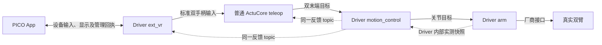

# 双臂遥操四卡实现与验收契约

将设备接入、通用遥操映射、机器人运动学和硬件执行分开，让用户从 Canvas 齿轮页完成 PICO 安装与连接，再通过头显完成双臂遥操。主仓 [#259](https://github.com/4paradigm/phanthymotus/pull/259) 负责通用 teleop 和必要的 Core 宿主适配；天轶执行沿用 [#321](https://github.com/4paradigm/phanthymotus-driver/pull/321)，ext_vr 和北京 G1 执行分别使用独立 Driver PR。

**状态：Draft / 实施与验收契约，2026-09-23。本次提交仅更新文档和 PR 说明，不包含四卡运行时实现、部署或新的硬件验收。已有三卡代码及历史结果继续保留，不能勾选本方案的验收项。** PR 正文与本文件同步维护，作为工程实现及用户、雨强验收的依据；范围变化必须同步验收条目，不以聊天记录隐式改变要求。

## 确定的架构

| 卡片 | 职责及部署边界 | 不承担的职责 |
|---|---|---|
| `ext_vr` | 共享实现由 G1/天轶 Driver bundle 加载，复用现有 MCP；App、安装、配对、WSS/RTC、输入规范化和显示传输 | 不申请运动租约，不加载 URDF，不运行 IK |
| `teleop` | 普通 ActuCore 内的双臂卡片；输入时效、双握把使能、相对映射、缩放与开始/结束/停止编排 | 不处理 PICO SDK/配对/下载，不持有机器人模型或输出关节解 |
| `motion_control` | 各机器人 Driver 内；URDF/TCP/标定、FK/IK、碰撞、关节参考及统一显示/执行反馈 | 不解释设备私有协议，不把数值工作放进硬件执行循环 |
| `arm` | 各机器人 Driver 内；连续关节目标、共享执行权、限位限速、持续下发、实测反馈、保持/停止及已有恢复操作 | 不依赖 PICO、teleop 或 IK 存活才允许停止 |

四张卡不等于四个服务。ext_vr 沿用 ext_mic/ext_camera 的实例配置与注册方式；PICO 传输监听是 bundle 内能力，不新增独立 MCP 服务或容器。ActuCore 保持普通服务形态，设备和数值依赖分别迁到对应 Driver；正常镜像构建直接包含所需依赖与 APK，不新增 BOT 服务或遥操构建开关。

### 固定输入与输出

设 `R=/<robot_namespace>`、`V=<ext_vr_instance>`。首版一个 teleop 绑定一个输入设备和同一 Driver 内的一组 motion_control/arm。

| 卡片 | 输入 topic | 输出 topic |
|---|---|---|
| ext_vr | `R/motion/teleop/feedback` | `R/ext_vr/V/input` |
| teleop | `R/ext_vr/V/input`、`R/motion/teleop/feedback` | `R/motion/control/command` |
| motion_control | `R/motion/control/command` | `R/motion/arm/command`、`R/motion/teleop/feedback` |
| arm | `R/motion/arm/command` | 无新增公开反馈 topic，实测状态在 Driver 内共享 |

| 数据 | 契约 |
|---|---|
| 标准设备输入 | `motus.xr.input/1`，`data/json`；左右控制器位姿、握把、头显参考与逐对象跟踪有效性，设备/实例/连接/空间代次、序号、源采集时间及接收主机单调时间。位姿统一米和 `xyzw` 四元数；tracking 坐标采用右手系 X 前、Y 左、Z 上，由 ext_vr 归一化。 |
| 双末端命令 | `motus.control/2`，`mode=eef_pose`，`control/eef`；左右各 `xyz + xyzw`，共 14 个数。目标 frame、末端标识和标定版本由下游 descriptor 声明。 |
| 关节命令 | `motus.control/2`，`mode=joint_position`，`control/joint`；G1_23 为 10 维，天轶为 14 维，单位 rad，顺序由 descriptor 声明。公开消息只传位置，不增加 `tau_ff`，描述符 `force_torque=null`。 |
| 统一反馈 | `motus.motion.feedback/1`，`data/json`；关联会话/输入/执行序号、实测关节与末端、IK 结果、控制权/执行状态、时效、拒绝/保持/故障原因及可变长度显示链。由 motion 唯一发布，teleop 与 ext_vr 直接订阅。 |

上述新增或统一 schema 是实施目标，不声称当前所有消费者已支持。沿用 `/2` 的会话、序号、映射代次、模型/标定、原始单调截止时间及认证语义；把现有天轶解析器的硬编码 14 维改成绑定的能力维数。旧 `/1` 及已发布动作 API 保持兼容，不把关节数组重新解释为位姿。

连续帧不经过 Agent Core 或逐帧 MCP。开始、结束、立即停止使用可靠管理请求及最终回执，携带请求 ID、绑定身份和去重语义；管理目标来自已验证的 Canvas 绑定，不接受头显指定任意 URL。设备状态通过 `info(instance_id)` 查询，不新增 ext_vr status 或 teleop→ext_vr 显示中转 topic。反馈的显示字段不代替 teleop 自己的项目 armed、映射状态和操作回执。

Canvas 显示三条正向连接及 motion 到 teleop/ext_vr 的两条反馈连接。反馈绑定同一 motion 实例，不进入项目启动依赖环。arm→motion 的内部状态读取不额外增加 Canvas 连线。

### 连续跟随与通信恢复

- 输入停住但持续有新鲜采样时，机器人继续追向目标；不能以“坐标未变化”判断离线。心跳不能刷新旧位姿时间，头显时钟不能直接与机器人单调时钟比较。
- 丢帧后收到较远但合法的新目标，从当前保持位置平滑追赶最新目标；不补播历史帧，不仅因差值大拒绝，不把丢帧当作重握并重置映射。
- 松开任意握把保持；重新握住按新鲜控制器及机器人实测末端建立新基准。空间重置使旧基准失效，须重新建立基准；普通通信或短暂 IK 恢复保留原映射。
- 暂不可达或碰撞时保留最后有效位置附近，持续处理最新输入；后续可执行时继续，不新增越界搜索，不把普通不可达变成永久故障。
- motion 输出完整关节参考，取消“每输入一帧仅推进 20 ms”的执行限幅。arm 用实际执行周期持续插补限速，保留单步时间上限，不能积累停顿时间后突然追赶。20 Hz 输入不应额外变成 20 ms×20 Hz 的速度配额。
- IK/FK/碰撞留在独立数值进程。为当前目标生成覆盖实测、已下发点与近期插补范围的验证记录，关联序号、模型/标定和源截止时间；arm 只做轻量包含/时效检查。超出已验证范围时保持并异步刷新，不在停止/执行锁内等待求解。直接关节回放也使用该验证器。
- 卡间 DDS 使用同机 domain 42 和本机隔离，最新流统一兼容的 BEST_EFFORT/KEEP_LAST depth=1/VOLATILE，内部队列也有界。回调只校验与更新最新输入；显示和关节发送队列分离，记录异步写入。
- 反馈拥堵允许丢弃旧快照，不得永久退出状态线程。DDS 子进程局部恢复清空旧数据并切换通信代次，保留原执行门、控制权、释放请求和收臂回执，不靠重启整个 Driver 清除未确认状态。
- 命令到期先保持，不延长旧帧有效期。通信恢复后，在原输出停止已确认、控制权归属明确、输入及反馈新鲜时自动续接；需要重建本会话租约时保留映射。显式停止、Driver 重启、真实硬件故障不能被普通重连自动越过。

## 使用与范围

1. 在 Canvas 添加 ext_vr，点击齿轮配置设备、查看 APK 版本并生成下载二维码/短地址和连接邀请。项目未启动即可配对。
2. 在 PICO 浏览器下载并经系统确认安装；回下载页点击“打开并连接”，由深链接预填当前机器人配置，一键完成连接。已配对设备冷启动自动重连。手机扫码不等于安装到头显，安装器直接“打开”不保证继承浏览器配置；短地址是设备扫码不可用时的备用入口。
3. 连接四卡及反馈边，配置 teleop 的相对映射/比例和 Driver 的模型/速度，选择 Shadow 或 Live，保存并开启项目。开启项目只进入待开始状态，不自动运动。
4. 在 PICO 点击“开始遥操”，先松开握把，再同时握住两侧握把控制双臂；松开后保持，再握建立新基准。
5. 点击“结束并收臂”观察实际完成与控制权释放；“立即停止”只停止，不追加收臂。Canvas 停止项目和 Driver 独立停止/恢复入口在头显离线时仍有明确结果。

安装、配对、撤销与设备设置全部放在齿轮配置页；卡体仅显示状态、端口、齿轮及数据流入口。配置必须收到 Driver 回执并读回确认才持久化，失败保持上次确认值；邀请、凭据不进入可分享卡片参数、topic 或普通结果日志。应用签名保持稳定，签名不兼容时明确迁移，不静默卸载或清空配对。

首版只实现双臂，不实现手、腿、底盘、任意末端映射 DSL 或全身控制。两机开发对照采用 1 rad/s，允许约 20 Hz 输入、一定延迟及短暂停顿；要求条件恢复后继续，不新增百分比误差、累计行程或稳定 50 Hz 门槛。

天轶复用已有 finish/finish_status/stop/release，实际结果按反馈确认。G1 复用 arm.release→ExecuteAction(99)，先结束自家 SDK 流并交还控制，不新增回零 API，也不把厂商释放等同未经验证的精确零位。G1 最终下发位置的重力补偿在 arm 内独立计算。上述两种恢复和模型实现分别归对应 Driver PR。

### 四个 PR 的责任

| PR / Agent | 实施范围 |
|---|---|
| ext_vr 新 Driver PR / A | App、设备协议、安装/配对鉴权、输入、显示、G1/天轶 bundle 的最小设备接入；设备功能契约及其验收 |
| 主仓 #259 / 主 Agent | teleop、端口和反馈绑定、生命周期；另列 ext_vr 的 Core 宿主适配提交（齿轮页托管、固定下载代理、认证调用与配置确认），不把设备业务留在 teleop |
| G1 执行新 Driver PR / B | 北京 G1_23 motion_control/arm、模型、连续执行、补偿、SDK 交还及已有 release |
| 天轶 #321 / C | 天轶 motion_control/arm、模型、连续执行、恢复和 finish/stop |

四个 Agent 在独立 worktree 并行推进，公共协议和 bundle 注册由指定写入者整合固定提交，不并发写同一段。天轶和北京 G1 哪个空闲先测哪个，分别验收；不以其中一台结果替代另一台。普通 Core 的其他修改和原画布保留，部署前审查实际增量及占用，不用旧整份 Compose 一致性阻塞回放。

## 本 PR 交付与验证状态

### #259 验收条目

每条均为待验收要求。证据必须覆盖用户可观察结果，不能仅用 HTTP 200、publish 返回或测试替身记为物理通过。

| 编号 | 前置与操作 | 预期结果 |
|---|---|---|
| TEL-01 | 注册标准 ext_vr 输入和 G1/天轶 descriptor，分别建立四卡连接；故意缺边或错绑反馈实例 | 正确组合可准备；缺边/错实例有具体错误；不按型号静默回退旧 G1 适配器；反馈边不形成启动环 |
| TEL-02 | 同一标准输入记录分别绑定 G1 与天轶，检查 EEF 输出 | teleop 不加载模型或 PICO SDK，按下游 frame 输出同一 schema；左右映射、位置/朝向及缩放符合配置 |
| TEL-03 | 开始后双握使能、松开任意握把、再次握住 | 松开保持；重握使用新鲜实测和输入建立基准，无目标跳变；项目启动和设备连接本身不运动 |
| TEL-04 | 持续握住，20 Hz 输入；保持相同目标；插入短/长停顿后恢复较远且可达目标 | 新鲜相同目标继续推进；过期期间保持；恢复追最新目标且保留映射，不补播历史帧、不要求每次松握重握 |
| TEL-05 | 注入不可达、碰撞、短暂 IK 失败后回到有效输入 | 失败不输出；保持期间继续处理输入，恢复后继续；无越界搜索或反复无效重建会话 |
| TEL-06 | 重复/并发开始、结束、立即停止；断开头显后从 Canvas 停止；注入操作回执丢失 | 请求去重，停止可取消收臂；受理与完成分开；失败原因与重试入口可见，项目不永久停在“启动/停止中” |
| TEL-07 | 在 ext_vr 齿轮页安装/配对/配置；注入 Driver 拒绝与超时；检查保存内容和日志 | Core 宿主适配完成，卡体无设备表单；未确认配置不显示保存成功；秘密不进入持久配置/topic/普通日志 |
| TEL-08 | PICO、teleop 与 Driver 显示链联测，故意使反馈过期和显示拥堵 | motion 同一反馈直接给两个消费者；实际、IK、历史保持与未知状态可区分；显示不阻塞运动或停止 |
| TEL-09 | 使用最终版本完成用户日常全流程并回归现有 VLA、旧动作和旧协议 | 安装/配置/启停不依赖后端试验脚本；兼容功能不被迁移破坏；天轶与北京 G1 分别记录 |

### 验收顺序与记录

- [ ] **离线通过**：契约、生命周期、20/50 Hz、跳帧/恢复、隔离 DDS、真实数值求解、有限速度及滞后反馈对象、相关回归与目标架构构建。
- [ ] **开发真机通过**：先关节回放，再 EEF/实时 IK，再实体 PICO；检查 ROS 节点/topic/QoS/域隔离、实际厂商下发及实测反馈。
- [ ] **精确 HEAD 的 BOT review 通过**：前两阶段后主动申请；新提交重跑受影响检查并重新审查，不沿用旧 HEAD。
- [ ] **最终真机验收通过**：用户或雨强用审查后的固定源码/镜像/APK/配置组合复测上述条目。ext_vr 的真机为实体 PICO，可独立于机器人运动通过。

统一验收记录模板（未填不得视为通过）：

| 条目 ID | 阶段/设备 | 源码 SHA、配套版本、镜像/APK/模型/配置身份 | 实际步骤与证据链接 | 实际结果/失败原因 | 验收人/日期 |
|---|---|---|---|---|---|
| TEL-xx | 待填写 | 待填写 | 待填写 | 未验收 | 待填写 |

记录输入→EEF→IK→arm 接纳/拒绝→厂商下发→实测的同机时间、关联序号、拒绝原因、耗时分布、最长空窗、恢复时间和实际误差；异步采集，不要求输入帧数等于执行帧数。厂商报文无序号时标注时间/目标匹配的不确定性。

### 冻结基线与历史证据

| 机型 | 行为基线 | 证据边界 |
|---|---|---|
| 天轶 | ActuCore unified r4：`sha256:584e7d3402c52c93a976f39740057dd73b9b90a06d0d4f935f356e035104c091`；Driver operator r16：`sha256:f41c7bb5352a29d3a41dc3d5d6357000a2634ad27cfb580d4546a9b1476288c1` | 固定同一输入、模型、标定、初始状态和速度比较；历史标定与当前不一致时不得沿用旧数值结论 |
| 北京 G1_23 | 2026-09-19 周六晚 `g1-visible-follow-20260919` / `visible-follow-ad47f01-r3-20260919` / PICO V036 | 历史来源上海；完整镜像身份、源码 manifest 与标定须补齐，不能冒称北京已验收或用当前 HEAD 替代 |

移除输入频率造成的额外限幅是本次预期行为变化，不要求逐帧关节解与冻结版一致。先验证执行链，再比较完整链路的动作进度、延迟与中断；允许滞后，不能把卡死隐藏成通过。

远端 #259 在本次文档提交前为 `d7e0c16d29a2e56d978e92fd28e0acb80e730727`。其旧正文与版本化历史结果保存在 [PR #259 历史说明](../validation/teleop-pr259-history-20260923.md)，不当作本四卡方案的完成证据。现有三卡实现见 [历史架构说明](../design/teleop-architecture.md) 和 [历史操作手册](../../actucore/plugins/teleop/README.md)；两者开头标明适用版本，本文件和 PR 最新正文规定后续目标。
