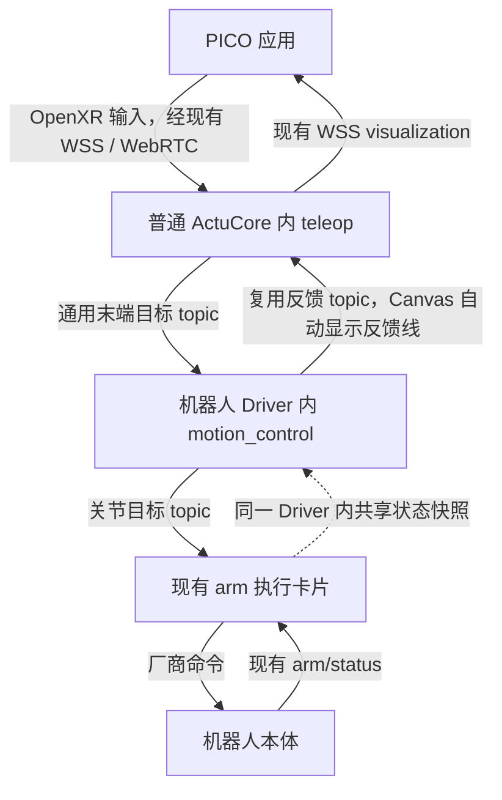

# PR #259 历史说明归档

2026-09-23 改写四卡契约前的远端正文快照。以下内容保留历史版本、构建和现场记录，不代表当前设备状态，也不作为新四卡方案的验收通过。

原 PR：https://github.com/4paradigm/phanthymotus/pull/259；当时 HEAD：`d7e0c16d29a2e56d978e92fd28e0acb80e730727`。

最新实施与验收依据见 [四卡契约](../plans/teleop-four-card-contract.md)。

---

将遥操的通用输入与机器人运动学拆开，同时补齐新 PICO 从 Canvas 下载安装、一键连接和日常使用入口。配套 Driver：[#321](https://github.com/4paradigm/phanthymotus-driver/pull/321)。

**状态：Draft，新架构已部署至天轶的禁执行配置；真实 ROS 预览与反馈链通过，Canvas 三卡已加入。实体 PICO 新设备安装、真实跟随及收臂尚未验收。**

## 确定的架构

| 边界 | 职责 |
|---|---|
| ActuCore `teleop` | PICO 接入、配对、跟踪与握把、通用相对映射、末端目标、显示反馈转发；新天轶路径不加载 URDF 或运行 IK |
| Driver `motion_control` | 机器人 URDF/TCP/标定、FK/IK、碰撞、执行器映射、运动会话及结束收臂；在现有 Driver 内，不新增服务 |
| Driver `arm` 等执行卡片 | 新增非阻塞连续目标 topic 入口，复用现有硬件发布与反馈；共享执行权、最终关节限位限速、断流保持与停止确认 |

`arm → motion_control` 直接共享 Driver 内实测缓存和执行记录，不新增反馈 topic 或 Canvas 边。`motion_control → teleop` 复用已有反馈 topic，增加实际姿态、IK 与状态；Canvas 随正向控制连接自动建立并显示这条反馈线，且反馈边不参与启动依赖排序。`teleop → PICO` 保留现有 WSS 显示通道。反馈异步处理，不要求每条运动指令等显示完成。

连续数据沿用同机 ROS 2 domain 42、最新目标模式。新增 `motus.control/2`，复用 `/1` 的 mode/values/groups 语义并明确会话、序号、输入关联、映射代次、单调时钟期限与鉴权；旧 `/1` 保持兼容。上游 `eef_pose` 是指定坐标系下的米制 xyz + xyzw 单位四元数，下游 `joint_position` 是声明顺序的 rad 关节目标。低频管理继续使用 MCP。

每次重新使能使用 Driver 新鲜实测末端快照建立相对基准；旧映射或过期 IK 结果丢弃。碰撞、不可达或短暂 IK 失败保持最后有效位置附近，持续求解最新输入并同会话恢复，不增加越界搜索。结束收臂由 Driver 返回厂商模型双臂零位（14 关节 q=0，本轮自然下垂目标），按真实反馈确认后释放；立即停止不收臂。Shadow 无执行权和硬件目标，重新连接或重启不自动恢复运动。

## 使用与范围

Canvas 模板为 `teleop → motion_control → arm`，配置和启停无需后端试验脚本。配置页提供二维码/短地址，从普通 ActuCore 容器下载固定签名 APK；安装后回页面点“打开并连接”，深链接预填机器人配置并消费 15 分钟、单次、可撤销邀请。已配对应用可自动重连，但不能自动开始运动。系统安装确认保留；系统扫码能力另作 PICO 实机验证，短地址为备用。

本轮只迁移天轶双臂。双臂使用同一租约和一个原子命令，descriptor 声明左右各 7 关节的 arm_l/arm_r group，执行默认 1 rad/s。协议按能力描述支持未来单臂、手和其他末端，不在本轮实现手腿控制或跨卡原子执行。现有 G1 路径、VLA、`move_pos/move_ctrl/move_traj` 和 `/1` 保留，不把关节数组重新解释成位姿。

普通 ActuCore 与 VLA 共用服务；不增加遥操容器，不要求 bot 新开关。Agent Core 仅增量改动端口协商、自动反馈线、配置与下载代理，不覆盖其他业务修改。

## 本 PR 交付与验证状态

本仓负责 ActuCore 通用目标、Canvas 端口与反馈绑定、PICO 安装连接及显示；控制模型、IK、硬件流入口和收臂由配套 Driver PR 交付。继续在 #259 汇总，不新增重复 PR。实施计划、架构及使用手册与代码在同一提交：

- [实施计划](https://github.com/4paradigm/phanthymotus/blob/402bd1f54b58c64b87c3f9314b51c38b617a3036/docs/plans/teleop-end-effector-architecture.md)
- [协议与架构](https://github.com/4paradigm/phanthymotus/blob/402bd1f54b58c64b87c3f9314b51c38b617a3036/docs/design/teleop-architecture.md)
- [Canvas/PICO 使用手册](https://github.com/4paradigm/phanthymotus/blob/402bd1f54b58c64b87c3f9314b51c38b617a3036/actucore/plugins/teleop/README.md)

当前离线结果：Core **1457 passed / 1 skipped / 8 subtests passed**；ActuCore **685 passed / 46 skipped**（G1 数值 ABI、私有录制和显式 ROS 入口另报）。配置先经 Driver 接受并读回，再持久化，拒绝/超时不误保存；Canvas、LLM 和 direct/hook 管理入口共用本机鉴权，禁止转发凭据及重定向。保留 Preview 释放和短暂丢反馈后持续握把的恢复握手，真正故障不自动续动。

同一份 10 秒 PICO 录制含 719 帧、718 帧有效：在同一已有标定及相同逐帧关节反馈下，迁移前后均为 523 个有效解、195 个不可达，分类分歧为 0，关节最大差 6.49e-13 rad；P95 求解耗时 10.68/10.36 ms。未找到录制当时精确匹配标定，因此这是逐帧迁移对照，不代表原现场复现或连续物理跟随。保留 100 ms IK 预算，不新增误差百分比门槛。

真实 ROS 隔离集成另行 **2 passed**：本机 ARM64 禁网只读容器，真实 domain 42、Driver bus 子进程、EEF/joint/feedback topic、实际 IK 与执行门；MCP HTTP 和厂商本体是替身。Shadow 无 joint/厂商输出，Live 有限速度模拟与暂停确认通过。这不代表真实机器人通过。

本地 Chrome 卡片交互通过；PICO release APK **0.3.18-onboarding1** 完成实际构建、签名、16 KB ELF 与 11 份许可资产验证。固定构建制品匿名下载、解压及 APK SHA256 校验通过，普通镜像构建直接携带，不依赖新增 bot 开关。原 debug 签名设备需显式迁移，未安装或操作实体头显。

此前 HEAD `3e993b58` 的普通 Core/JP6.1 ActuCore bot 构建均通过，镜像内测试分别为 **1451/586 passed、0 failed**。[测试回执](https://github.com/4paradigm/phanthymotus/pull/259#issuecomment-5778587351)。已修复旧测试抽取 Core wrapper 时未显式加载共享 helper 的问题，生产鉴权不变。JP5.1.1 不下载或准备遥操 APK；NDK 完整 NOTICE 从固定 SDK 校验生成，实际 Gradle 合并内容与现有 APK 一致，不裁剪许可。JVM 生产邀请解析/TLS 与 Python Enrollment 的 15 项真实 localhost 互通检查通过；不替代 Android Activity/实体浏览器安装验收。

用户确认空闲并明确批准保留现场修改的 Core 增量后，已部署普通 ActuCore、motion_control Driver 与 Core 增量。现场原 16 张接待卡完整保留，新增 `teleop → motion_control → arm` 与反馈边；项目停止、Driver Live 门关闭，Perception 保持原容器。真实 domain 42 预览：45 个 EEF 输入、44 个关联决策、190 个反馈，ActuCore 收到实际 IK 显示数据；独立本体观察中 joint/cmd_pos/cmd_ctrl 均零消息，Preview 已释放。此结果不是实体 PICO 渲染或双臂动作验收。

现场 Canvas 默认 `localhost` 注册曾导致运动卡发现为空；`d360a454` 将确切本机别名规范为数字回环，发现、模板、绑定及相关生命周期回归 110 项通过。单独 Core 修复已部署，ActuCore/Driver/Perception 容器 ID 不变。安装入口实际生成二维码、匿名下载 2,428,106 B 的 APK 并核对 SHA256，撤销后拒绝旧链接；没有向实体 PICO 安装。首次模型配置请求曾超时，后续两次约 0.28/0.35 秒确认，原因未复现，不将冷启动假设写成根因。

旧现场物理结果不替代新架构验收。保留 PR #151/#152 的来源和许可证，APK、私钥、站点凭据与私有录制不提交 Git。

本轮审查修复（`5c70b162`）：下载票据转入现有共享 SQLite 的独立短期表，15 分钟绝对期限跨 Core 重启保持，同服务重生成撤旧，支持鉴权撤销和最多三次串行下载（含重试）。配对邀请仍单次兑换且不入库。新增生产 Plugin dispatch/MCP/Core/TLS package/download 契约测试，确认 MCP 的嵌套 package 摘要与 HTTPS 扁平元数据各自使用正确，未修改正确契约。

MCP 请求体新增 16 MiB 上限、10 秒完整读取期限及非法长度拒绝；真实 loopback HTTP 与隔离 Shell 专项 39 项、Core 管理 HTTP 21 项通过。已移除失效的 `--with-teleop` / `WITH_TELEOP` 及独立标签变体，普通 JP6.1 仍自动携带遥操，不修改 bot 服务。registry 实测应用层共 93,340,999 B 压缩，其中遥操依赖层 85,810,339 B、APK 2,381,531 B、G1 网格 4,438,722 B；保留 legacy G1 的兼容成本在 README 明确记录。

`5c70b162` 的普通镜像 bot 构建与镜像内测试已通过：Core 1457、ActuCore 601，均 0 failed；[回执](https://github.com/4paradigm/phanthymotus/pull/259#issuecomment-5779218973)。当前 localhost 修复另外请求最新 HEAD 复审，不沿用旧提交结果。

最新 `402bd1f5` 合并上游 `9802eae43f15`，解决 bot 报告的与 main 冲突，保留导航/control_stream/网络功能与遥操并存。合并验证：ActuCore 407、Core 82、Node 9 项以及本地 Chrome 面板通过；真实禁网 DDS 2 项通过。新增 ROS 测试替身仅在显式集成模式先导入真实 ROS，防止测试被替身遮蔽；初帧握手等待新鲜 FK 后开始输入，生产100 ms时效不变。首轮隔离失败及合并前对照保留，未把重试隐藏成一次通过。本次主线合并没有再部署到机器人，现场仍是上文记录的增量版本。
